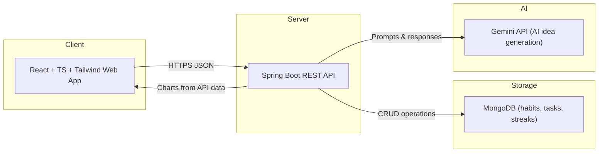
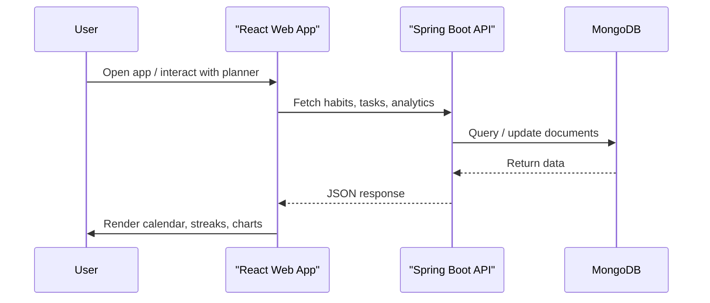

# Track Daily – Habit Tracker & Planner

Track Daily is a full-stack habit tracker and personal planner with day/week/month views, streaks, and analytics, built for web and Android.

<div align="center">

### 🌐 Live Web App  
[https://track-daily-eta.vercel.app/](https://track-daily-eta.vercel.app/)

</div>

---

## 🔍 Core Features

| Area            | What You Get                                               |
|-----------------|------------------------------------------------------------|
| Calendar views  | Day, week, and month timelines for tasks and habits[cite:2] |
| Habit tracking  | Positive/negative habits, streaks, and weekly matrix[cite:2] |
| Tasks           | Daily tasks with status and basic metadata[cite:2]          |
| Analytics       | Progress charts using Recharts[cite:2]                      |
| Customization   | Themes and personalized UI on both web and mobile[cite:2]   |
| Data handling   | MongoDB persistence, import/export JSON, offline-first[cite:2] |
| AI integration  | Gemini-powered idea generation for UX/UI improvements[cite:2] |

---

## 🖼 Screenshots (Web App)

| Agent / Overview | Sign In View – Tasks & Habits | Sign Up View – Habit Matrix |
|------------------|-------------------------------|-----------------------------|
|  |  |  |

| Active View – Planner | Analytics – Charts & Scores | Settings / Theme & Data |
|-----------------------|-----------------------------|-------------------------|
|  |  |  |

---

## 🧱 Tech Stack (At a Glance)

| Layer      | Tech                     | Purpose                                  |
|-----------|--------------------------|------------------------------------------|
| Frontend  | React + Vite             | SPA UI, fast dev/build pipeline[cite:2][cite:1] |
|           | TypeScript               | Type-safe components and state[cite:2]   |
|           | Tailwind CSS             | Utility-first styling & layout[cite:2]   |
|           | Framer Motion            | Animations and transitions[cite:2]       |
|           | Recharts                 | Analytics charts and visualizations[cite:2] |
| Backend   | Spring Boot (Java 25)    | REST API, business logic, validation[cite:2] |
|           | Maven                    | Build and dependency management[cite:2]  |
| Database  | MongoDB / MongoDB Atlas  | Habits, tasks, streaks, history[cite:2]  |
| AI        | Google Gemini API        | In-app AI feature idea generation[cite:2] |
| Infra     | Vercel (Web)             | Production web deployment for SPA[cite:1] |

---

## 🧬 Architecture & Data Flow



---

## ⚙️ Project Flow (High-Level)



---

## 🚀 Local Development

### 1. Clone

```bash
git clone https://github.com/ITACHI-01-cyber/Track_Daily.git
cd Track_Daily
```

### 2. Environment

Create `.env` in the project root:

```env
MONGODB_URI="mongodb+srv://<user>:<password>@<cluster>/?appName=<app>"
MONGODB_DATABASE="habit-track"
GEMINI_API_KEY="YOUR_GEMINI_API_KEY"
```

### 3. Frontend

```bash
npm install
npm run dev
# App runs on http://localhost:5173 or configured Vite port
```

### 4. Backend

```bash
cd backend
mvn spring-boot:run
# API on http://localhost:8080
```

---

## 📦 Android APK (Optional)

The project also ships an Android APK build of the tracker so you can use the same system on mobile.

